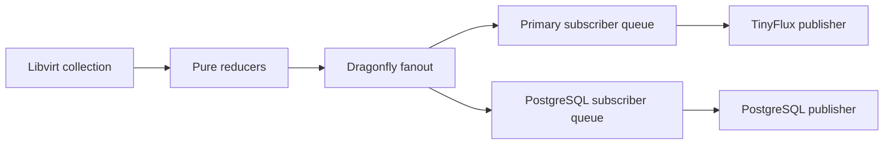
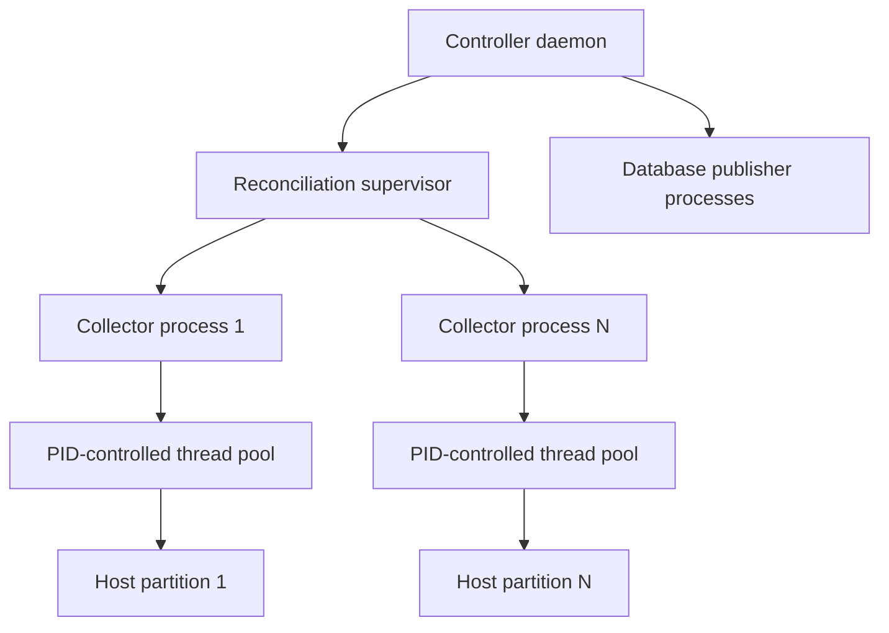

## Development

### Dependencies

On macOS, install Xcode Command Line Tools (`xcode-select --install`) and [Homebrew](https://brew.sh/), then install the development tools from the repository root:

```shell
brew bundle
```

The [Brewfile](Brewfile) includes pyenv, pyenv-virtualenv, Poetry, native build libraries, libvirt, Go, the Minikube toolchain, ShellCheck, shfmt, and actionlint. Initialize [pyenv](https://github.com/pyenv/pyenv#2-set-up-your-shell-environment-for-pyenv) and [pyenv-virtualenv](https://github.com/pyenv/pyenv-virtualenv#installation) in your shell before activating the environment below. The Docker CLI also needs a running engine; follow the [Homebrew Buildx setup instructions](https://formulae.brew.sh/formula/docker-buildx) to make `docker buildx` available.

Use Python 3.14, pyenv with pyenv-virtualenv, and Poetry 2.5.1 or newer. Create and activate the development environment with:

```shell
pyenv install --skip-existing "$(cat .python-version)"
pyenv virtualenv "$(cat .python-version)" premiscale
pyenv activate premiscale
poetry install
```

Poetry uses the active pyenv environment for dependency installation and package builds.

On macOS, `libvirt-python` builds against the Homebrew headers and API description selected by `pkg-config --modversion libvirt`. The lockfile uses bindings 12.7.0, matching Homebrew libvirt 12.7.0. Older 11.x bindings fail against this library with `Missing type converters: virTypedParameterPtr` and `ERROR: failed virDomainAnnounceInterface`. After updating this checkout, run `poetry install` in the Python 3.14 environment. If a later Homebrew upgrade introduces another API-generation error, update the Python bindings to a compatible release and regenerate the Poetry lockfile and requirements export together. The Python version in Poetry's own installation path can differ from the project interpreter; check the latter with `poetry run python --version`.

Install the Git hooks after installing dependencies, then check the full repository:

```shell
poetry run pre-commit install
poetry run pre-commit run --all-files
```

Pre-commit checks typed Google docstrings, generated configuration schemas, controller examples, the Poetry lockfile, Pylint, mypy, ShellCheck, and shell formatting. Local Python checks use `scripts/validation/python.sh` to select the `premiscale` pyenv environment even when Git inherits a different active environment from your shell or editor. When that environment is unavailable, the runner uses `poetry run python`, including in CI. Install the locked dependencies with `poetry install` after activating `premiscale`; hooks do not install dependencies automatically. ShellCheck and shfmt come from the Brewfile. Pre-commit downloads isolated Python and Node environments for the pinned documentation tools on its first run. The Helm README hooks regenerate the `Parameters` tables in both charts, so review and stage those updates before committing. Keep handwritten chart documentation outside that generated section. To fix shell formatting, run `shfmt -w -i 4 -ci -sr` with the affected script paths.

Install [asdf](https://asdf-vm.com/guide/getting-started.html#_1-install-dependencies), followed by running `asdf install` in the root of this project.

### Static configuration

Store configuration files for supporting services, including Grafana, in [.config/](.config/), grouped by service.

Group packaged SQL, SSH, Lua, and AWK files under [`pkg/premiscale/support/`](pkg/premiscale/support/), with a subdirectory for each language or format.

Keep SQL statements in individual `.sql` files under [`pkg/premiscale/support/sql/`](pkg/premiscale/support/sql/), grouped by backend. Load them with `premiscale.support.sql.load_sql()` and pass values separately through the database driver's parameter binding. Do not embed SQL in Python strings. Statements are packaged with the application and loaded independently of the working directory; transaction boundaries remain in the calling Python code.

Keep programs and configuration templates in files for their own language rather than embedding their source in Python strings or shell heredocs. Redis Lua programs belong under [`pkg/premiscale/support/lua/`](pkg/premiscale/support/lua/), grouped by subsystem, and use the cached `load_lua()` resource loader with keys and arguments passed separately. The SSH host template lives under `pkg/premiscale/support/ssh/`; AWK programs live under `pkg/premiscale/support/awk/` and use `awk -f`. Read runtime resources through `importlib.resources` so installed packages work from any directory. Keep development helpers in `scripts/` and test programs and XML/YAML fixtures under `pkg/tests/data/`.

Define infrastructure data models with `attrs` under [`pkg/premiscale/schemas/`](pkg/premiscale/schemas/), grouped by provider. Hypervisor collectors construct these models; use `cattrs.unstructure()` when a dictionary is needed at a serialization boundary. QEMU host snapshots and domain statistics live in `schemas/qemu.py`. Keep driver-specific capability trees and counters as typed mappings where their fields vary between hosts.

Keep transport setup under [`pkg/premiscale/connections/`](pkg/premiscale/connections/). `Host` construction expands settings without writing SSH files. Metrics connections and the Cluster Autoscaler call `connections.ssh.configure_ssh()` when preparing an SSH connection; TLS connections skip it. The helper serializes updates across processes and threads, preserves existing exact host entries, and installs private keys atomically with mode `0600`.

### Kubernetes

The [`premiscale-crds` chart](charts/premiscale-crds/README.md) owns the typed configuration API schemas and renders named collections of ControllerConfig, Host, and AutoscalingGroup resources. Edit its `crds/` schemas, then run `poetry run python scripts/schemas/generate-config-schemas.py` to update Helm and local-file validators. CI runs the generator with `--check` to detect drift. Local startup still reads the controller YAML file. Kopf publishes ASG status. With `configMap.source: crds`, the elected operator projects a selected ControllerConfig and its Host/ASG references into the runtime ConfigMap; an installed Reloader rolls affected Deployments. See the [chart configuration guide](charts/premiscale/README.md#runtime-configuration-and-crds).

The [Minikube integration](integrations/minikube/README.md) starts the local cluster, builds and loads the development image, and installs PremiScale with Dragonfly, Cluster Autoscaler, and CloudNativePG. It waits for readiness and checks HTTP, gRPC, and queue delivery.

```shell
./integrations/minikube/minikube.sh start
```

After a code change, run `./integrations/minikube/minikube.sh enable` and `./integrations/minikube/minikube.sh test`. To stop the cluster while preserving local data:

```shell
./integrations/minikube/minikube.sh stop
```

### Controller API

`premiscale.api.create_app()` builds the Flask application and registers endpoint blueprints from `pkg/premiscale/api/`. In Kubernetes modes, the Kopf child serves `/healthz` at `controller.healthcheck.host:port` (8085), while Flask serves `/ready` and `/metrics` at the same host on `controller.healthcheck.apiPort` (9090). Health checks read atomic, cached process observations shared through a private per-run directory; missing or stale state fails the checks. Standalone modes serve all paths through Flask on the original port. See the [operator health contract](charts/premiscale/README.md#operator-health-and-shared-state) and [ASG status semantics](charts/premiscale-crds/README.md#autoscalinggroup-status).

To add a top-level API path, create an endpoint submodule with a `create_blueprint()` builder and register it with its URL prefix in `create_app()`. Initialize shared Flask extensions in the app factory.

### Cluster Autoscaler

The [Cluster Autoscaler submodule](pkg/premiscale/cluster-autoscaler/README.md) contains the Go gRPC frontend and its Python integration. It implements the upstream external cloud-provider protocol, provisions QEMU/libvirt worker VMs from configured templates, and journals pending operations for restart recovery. See its README for bootstrap, TLS, persistent storage, build, and test configuration.

### Controller daemon

See the [operator process tree](pkg/premiscale/daemon/README.md) for the single-container and separate-worker layouts, thread ownership, health reporting, and shutdown behavior.

`premiscale.daemon.start()` runs in the parent process and supervises the API and workers as child processes. The `daemon/processes/` package separates the HTTP API, Kopf operator, platform registration, action consumption, metrics publishers, reconciliation, and the Kubernetes provider into importable entry points. Each service constructs its resources after spawning, and mode selection happens in `processes.build()`. The API child builds the Flask app and serves directly in its main thread; Werkzeug handles concurrent requests within that child.

SIGINT and SIGTERM request shutdown. The parent sends SIGTERM to its child process groups, allows up to ten seconds for cleanup, then kills surviving children and descendants and waits up to five seconds to reap them. The API closes its listener and each worker closes its own broker connection. An unexpected required-service exit, including an API bind failure or an unexpected successful return, stops the controller and returns failure; declined platform registration is optional. Requested shutdown returns zero. These processes require POSIX and use Python's `spawn` context.

### Work queues

Workers exchange versioned JSON through Dragonfly using `redis-py` and Redis Streams. There is no multiprocessing manager or shared-process queue. Set `PREMISCALE_REDIS_URL` to the Service URL (standalone default `redis://dragonfly:6379/0`) and `PREMISCALE_QUEUE_NAMESPACE` to a value shared by workers belonging to the same controller. Helm installs Dragonfly by default and discovers its release-scoped Service when `controller.broker.url` is empty. Disable `dragonfly.enabled` to use an external broker. `controller.broker.existingSecret` and `secretKey` inject a URL containing credentials from a Secret; the namespace defaults to `<release namespace>:<release name>`. An explicit `controller.broker.url` or `namespace` in the controller YAML overrides these environment defaults. Use `rediss://` for TLS and `controller.broker.caFile` for a custom mounted CA.

Messages are acknowledged after successful handling. A worker renews its delivery lease while processing; after shutdown or a crash, another consumer can reclaim unfinished work after `controller.broker.leaseSeconds` (default 60). Delivery is at least once: a crash after a side effect but before acknowledgement can repeat that operation, so handlers must be idempotent. Malformed envelopes and unsupported payloads go to a separate dead-letter stream. Stream keys use `premiscale:{<namespace>:<channel>}:queue` and `:dead-letters`, with channels `autoscaling` and `platform`. Monitor pending messages and dead letters; they are deliberately retained rather than trimmed during failures. Platform acknowledgement means the websocket send completed, not that the remote application persisted the message.

The standalone reconciliation and VM action classes remain incomplete; their explicit JSON codec currently supports the no-op action and rejects unsupported commands. Kubernetes VM provisioning and deletion use the existing gRPC provider and its persistent operation journal. Redis replaces the queue transport, not that journal or other local storage. Keep one active provider per journal. Configure Dragonfly persistence, recovery, and a non-evicting memory policy for work queues; messages survive controller restarts only as long as the broker retains them.

The chart supports `singular`, consolidated `ha`, and split `hha` compositions. HA modes elect one controller subtree while replica workers remain active; see the [process trees](pkg/premiscale/daemon/README.md). Each worker creates its own client after spawning, so no live connections or queue handles cross process boundaries. Kubernetes must allow the pod to reach the Dragonfly Service and provide at least 15 seconds for controller shutdown; the chart defaults to 30 seconds.

### Metrics collection and publication

Libvirt subclasses collect raw attrs snapshots through `collect_domain_stats()` and `collect_host_stats()`. Pure functions in `metrics/reduction.py` turn domain snapshots into database-independent `Metric` and `MetricBatch` models. Database point construction happens in the publisher adapters. Reduction preserves timestamps and cumulative CPU/network counters; utilization rates require successive samples. Block allocation uses `<mountpoint>_utilization`, correcting the previous misspelled field and aggregation bug.



`standalone` and `kubernetes` modes start reconciliation, which owns separate collector and publisher supervisors. Collection uses one subprocess per available logical CPU; publication uses bounded connection processes per database. HA modes transport metrics through Kafka with independent subscriber consumer groups. External-metrics modes do not start collectors or publishers; standalone external-metrics mode still runs decision reconciliation. Existing `controller.databases.timeseries` settings configure the `primary` TinyFlux publisher and reconciliation read store. Add destinations under `controller.databases.publishers`:

```yaml
controller:
  databases:
    # Other existing database settings remain required.
    timeseries:
      type: memory
      retention: 300
      dbfile: /var/lib/premiscale/timeseries.csv
    publishers:
      postgresql:
        type: postgresql
        dsn: $PREMISCALE_METRICS_POSTGRES_DSN
        retention: 86400
        connectTimeout: 5
        statementTimeout: 10000
```

Supply the DSN through a Kubernetes Secret using `controller.extraEnv`, pointing at your CloudNativePG cluster's read-write Service. The operator dependency installs the operator; a PostgreSQL cluster, database, and credentials must also exist. The publisher creates `premiscale_metrics` and its timestamp index on first connection, so its database role needs permission to create these objects and write/delete rows. SQL resides under `pkg/premiscale/support/sql/metrics/`.

Fanout writes a common message UUID to streams named `premiscale:{<namespace>:metrics}:<publisher>:queue`. A shared Redis hash tag puts them in one cluster slot; Lua validates destination types and appends copies without another client interleaving. Every subscriber has its own backlog, leases, acknowledgements, and dead-letter stream. Database failures retry with bounded backoff while other subscribers continue. Acknowledgement follows a successful write. PostgreSQL commits each batch transactionally and deduplicates by message UUID plus sample index; TinyFlux uses reserved `_premiscale_sample` tags.

Delivery is at least once. Configure broker persistence and memory limits for the required durability. A broker outage can prevent the current collection pass from being enqueued; the collector reports the failure and samples again next interval. Keep publisher names stable across restarts: removed publishers leave their backlogs intact, and new publishers receive future publications. Failed subscriber queues are not trimmed.

Use persistent CSV storage when TinyFlux measurements must survive a publisher restart or be read by reconciliation. In-memory storage belongs only to that publisher process. Run one writer per CSV path; configuration rejects duplicate paths among this controller's publishers. Add future database adapters by implementing `Publisher.publish()` and `close()` under `metrics/publishers/`, adding an attrs backend configuration with a lazy `.publisher()` method, and extending the CRD schema and typed backend union. Collectors and reducers remain unchanged.

### Collection concurrency

In singular mode, reconciliation sizes its collection subprocess pool at startup from Python's affinity-aware CPU count, capped by visible cgroup v1/v2 CPU quotas. A fractional CPU quota is rounded up, with a minimum of one process. Hosts are partitioned deterministically across those processes; every configured host belongs to exactly one partition. If there are fewer hosts than CPUs, empty workers idle without opening clients. CPU allocation and host configuration changes take effect after a controller restart.



Each worker measures successful host collections per second of active collection, including reduction and enqueueing. By default, its target is `partition size / controller.databases.collectionInterval`: enough throughput to visit its partition within the interval. Empty hosts count as successful collections; unavailable hosts, collection exceptions, and broker publication failures count as failures. Each pass visits all assigned hosts, refilling available threads without waiting for slow peers in a fixed batch.

The PID controller uses relative throughput error, exponential smoothing, a deadband, bounded integral accumulation, and a maximum change per pass. It rebuilds the thread pool between passes, after all current host operations finish. Any failed host freezes concurrency and clears feedback history to avoid increasing connection pressure during outages. A stalled libvirt call cannot be preempted by thread resizing; process supervision bounds shutdown. Per-worker logs report throughput, target, failures, and the current and next thread counts.

Configure the controller under `controller.reconciliation.collection` (the whole section is optional):

```yaml
controller:
  reconciliation:
    interval: 60
    collection:
      minThreads: 1
      initialThreads: 1
      # targetThroughput: 1.0  # Optional successful hosts/second PER WORKER.
      proportionalGain: 1.0
      integralGain: 0.1
      derivativeGain: 0.05
      smoothing: 0.3
      deadband: 0.1
      maxStep: 2
  databases:
    collectionInterval: 60
    maxHostConnectionThreads: 10
    hostConnectionQueueSize: 10
```

`maxHostConnectionThreads` and `hostConnectionQueueSize` are per-process limits. Aggregate connection concurrency is bounded by `available CPUs × maxHostConnectionThreads`, further limited by partition sizes. The minimum and initial thread counts must fit the configured maximum. Gains apply to relative error; integral and derivative terms use seconds. Tune the gains and target for observed host latency rather than assuming the defaults suit every fleet.

Every collection process creates its own broker and hypervisor clients after spawning; collectors never open state or metrics databases. A separate `_state` subscriber writes observations through the singular or elected reconciliation publisher pool. Use persistent SQLite state in singular mode or shared PostgreSQL journals in HA. See the [managed VM collection pipeline](pkg/premiscale/metrics/README.md) for ownership checks, pure reduction, state revisions, explicit metric units, and the InfluxDB 2.x publisher.

A collector's unexpected exit fails reconciliation and then the daemon, allowing Kubernetes to restart the controller. Normal shutdown stops and reaps nested workers with a five-second grace period and a one-second forced-cleanup deadline, inside the daemon's longer deadline. Nested workers remain in reconciliation's process group so daemon cleanup also reaches them after an abrupt reconciliation exit. No management process or multiprocessing queue is used.

### Unit tests

Every handwritten Python function and class, including private helpers and tests, must have a Google-style docstring. Keep opening and closing triple double quotes on separate lines. Document each parameter in `Args` with its type, and document typed `Returns` or `Yields` as appropriate. Use `Returns: None` for functions that do not return a value; constructors document their arguments under `__init__` and omit `Returns`. Document exception types and failure conditions in `Raises` when applicable, and class fields under typed `Attributes` entries.

Pre-commit and CI run `pydoclint` with argument, return, yield, and exception checks enabled, including short docstrings. Types in docstrings must agree with signatures. The companion presence/layout check covers missing docstrings and standalone quote lines. Compiler-generated protobuf/gRPC files are excluded from these handwritten documentation checks; regenerate them with the existing generator.

```shell
poetry run python scripts/validation/check-docstrings.py pkg scripts integrations
poetry run pydoclint --config=pyproject.toml pkg scripts integrations
```

GitHub Actions runs Python 3.14 unit tests, configuration schema validation, mypy, Pylint, ShellCheck, package builds, and development-container checks on pull requests and pushes to `master`. The reusable Helm workflow builds locked chart dependencies, lints each chart, and runs `astrivant/hypothesis-helm` against `charts/`, uploading its reports even when a chart fails validation.

Run [unit tests](./pkg/tests/unit/) with

```shell
poetry run pytest -vrP
```

Install the test dependencies with `poetry install`. Pytest discovers tests under `pkg/tests/` and runs them in parallel using `pytest-xdist` with `-n auto`, configured in `pyproject.toml`. Override the worker count with `-n 4`, or use `-n 0` for a serial debugging run. See the [pytest-xdist worker options](https://pytest-xdist.readthedocs.io/en/stable/distribution.html).

Kafka integration tests use `PREMISCALE_TEST_KAFKA_BOOTSTRAP_SERVERS` and create isolated temporary topics. PostgreSQL journal and publisher tests use `PREMISCALE_TEST_POSTGRES_DSN`. CI supplies disposable Kafka, PostgreSQL, and Dragonfly services.

Broker integration tests use `PREMISCALE_TEST_REDIS_URL` and skip when it is unset. Point this at a disposable Dragonfly or Redis instance; each test uses and removes its own UUID namespace. The Python CI job runs these tests against Dragonfly.

PostgreSQL publication tests use `PREMISCALE_TEST_POSTGRES_DSN` and skip when it is unset. Use a disposable database: tests exercise committed samples, retry deduplication, rollback, and retention. CI supplies PostgreSQL alongside Dragonfly.

### Coverage

Test coverage against the codebase with

```shell
poetry run coverage run -m pytest -n 0
poetry run coverage report -m
```

### Publishing

Build and publish Python distributions with Poetry:

```shell
poetry build
poetry publish
```

Provide the PyPI token through `POETRY_PYPI_TOKEN_PYPI`. For another package registry, configure it with `poetry config repositories.<name> <url>` and publish with `poetry publish --repository <name>`.
