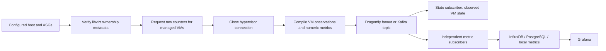

# Managed VM collection and publication

Collection has two phases, followed by independently acknowledged state and metric publication:

`Qemu.request_domain_stats(cluster, groups)` verifies the provider's metadata namespace, cluster, assigned group, and domain UUID before issuing `domainListGetStats` for the selected handles. Domain names alone do not establish ownership. No bulk statistics request is made for an empty or unrelated inventory. Stopped domains are included. A successful empty request returns `()`, while transport or ownership failures raise. This follows libvirt's [targeted statistics API](https://libvirt.org/html/libvirt-libvirt-domain.html#virDomainListGetStats).

The request returns immutable attrs envelopes containing VM identity, the original timestamp, and copied raw counters. Handles and XML do not cross the connection boundary. `compile_domains` is a pure second phase: it ignores irrelevant counters, handles sparse device indices, retains missing values as unknown, and produces `DomainObservation` and `Metric` values. Collectors never connect to SQL or time-series databases.

## State observations

The internal `_state` subscriber owns `vm_observations`, separately from the provider's requested lifecycle and volume journals. There is one state writer under reconciliation in singular mode and one under the elected controller in HA/HHA. Singular uses `config.controller.databases.state.dbfile` (ephemeral memory when unset); PostgreSQL journals configured through `config.controller.kubernetes.stateDsn` take precedence and provide shared persistence through failover. The legacy MySQL state implementation remains unsupported.

Each row is keyed by cluster and VM UUID and stores name, group, host, address, libvirt state/reason, CPU count, memory/storage capacity in bytes, freshness, change time, and revision. Fresh unchanged samples update `observed_at`; semantic changes advance `revision` and `changed_at`. Older or duplicate deliveries cannot overwrite newer observations, and missing counters retain prior known values. VM absence in a response never deletes state or authorizes deleting the VM. Reconciliation can use revisions and freshness to plan actions; publication itself does not execute provisioning actions.

State and metric consumers acknowledge independently after committed writes. A database outage retains that subscriber's delivery and does not stop the others. SQL statements live under [`support/sql/observations`](../support/sql/observations/) with PostgreSQL equivalents. The existing metrics wire format is retained: observations travel as a reserved `premiscale_vm_observation` measurement. New consumers decode it into typed observations and exclude it from metric storage. During a mixed-version rollout, old metric subscribers can still process the batch and may temporarily store that additional measurement.

## Metric families and units

| Measurement | Relevant fields | Additional tags |
| --- | --- | --- |
| `cpu` | Cumulative `cpu_time_ns`, `cpu_user_ns`, `cpu_system_ns`; current/maximum vCPU counts | — |
| `memory` | `current_bytes`, `maximum_bytes`, `rss_bytes`, guest `available_bytes`, `unused_bytes`, `usable_bytes`; `used_bytes` and `used_percent` when guest data supports them | — |
| `net` | Cumulative RX/TX bytes, packets, errors, drops | `interface` |
| `block` | Capacity, allocation, physical bytes; cumulative read/write bytes, request counts, and time in ns | `device` |
| `state` | Libvirt state and reason codes | — |

Every metric includes `id`, `name`, `cluster`, `group`, and `host`, using the acquisition timestamp. Unavailable counters are omitted. Derive CPU/network/IO rates from successive cumulative samples in the visualization query, allowing for VM restarts and counter resets. Allocated guest memory is not consumed memory. The former `total_cpu_utilization`, `total_net_utilization`, and mount-path-derived fields are replaced by these explicit counters; update dashboards accordingly. Raw guest disk paths are not stored as metric dimensions.

## Optional InfluxDB 2.x publisher

Use [`.config/influxdb/values.yaml`](../../../.config/influxdb/values.yaml) with an existing InfluxDB organization/bucket and a `premiscale-influxdb` Secret containing its write token under `token`. Merge its `controller.extraEnv` entries with any existing journal, Kafka, or PostgreSQL credentials: Helm replaces lists rather than appending them. CR-backed configurations use the same publisher fields under ControllerConfig `spec.databases.publishers`.

`InfluxDBMetrics` is an attrs backend configuration. Its publisher owns the HTTP session and performs synchronous writes to [`/api/v2/write`](https://docs.influxdata.com/influxdb/v2/api/write/), with bounded timeouts, certificate verification, and no credential-bearing redirects. [Line-protocol encoding](https://docs.influxdata.com/influxdb/v2/reference/syntax/line-protocol/) lives under [`support/influx`](../support/influx/), outside collection and reduction. Retries retain measurement, tags, and timestamp, which form [InfluxDB point identity](https://docs.influxdata.com/influxdb/v2/reference/faq/). Integer counters retain exact signed 64-bit values; unsupported or overflowing values fail before acknowledgement.

HA and HHA can delegate and scale InfluxDB subscribers through `autoscaling.publishers`, just like PostgreSQL subscribers. `connectionsPerReplica` bounds HTTP publisher processes. Bucket retention and Grafana's read credentials/data-source setup remain external to the publisher. This change does not install InfluxDB or Grafana.
